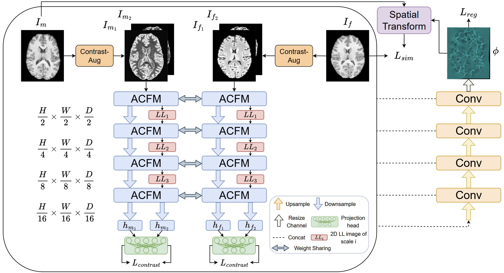
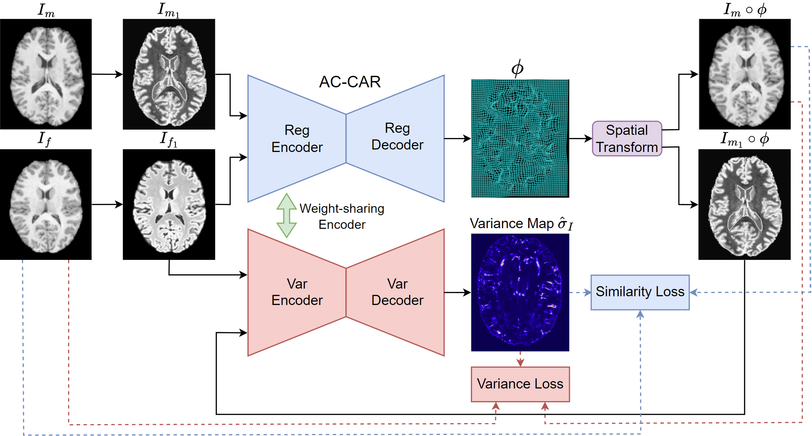

<p align="center">
  <h1 align="center">AC-CAR</h1>
  <h3 align="center">Adaptive Conditional Contrast-Agnostic Deformable Image Registration<br>with Uncertainty Estimation</h3>
</p>

<p align="center">
  <a href="https://arxiv.org/abs/2601.05981"></a>
  <a href="https://ieeexplore.ieee.org/"></a>
  <a href="https://www.python.org/"></a>
  <a href="https://pytorch.org/"></a>
  <a href="https://github.com/Yinsong0510/AC-CAR/blob/main/LICENSE"></a>
  <a href="https://github.com/Yinsong0510/AC-CAR/stargazers"></a>
</p>

<p align="center">
  <b>Yinsong Wang &middot; Xinzhe Luo &middot; Siyi Du &middot; Chen Qin</b><br>
  Imperial College London
</p>

<p align="center">
  <a href="#-highlights">Highlights</a> •
  <a href="#%EF%B8%8F-network-architecture">Architecture</a> •
  <a href="#%EF%B8%8F-prerequisites">Prerequisites</a> •
  <a href="#-data">Data</a> •
  <a href="#-training">Training</a> •
  <a href="#-inference">Inference</a> •
  <a href="#-key-results">Results</a> •
  <a href="#-citation">Citation</a>
</p>

---

## ✨ Highlights

- 🔄 **Train on single contrast, generalize to any** — trained on T1w only, yet works on T2w, PD, T1 mapping, and even CT‑MR at inference
- 🧠 **ACFM** — Adaptive Conditional Feature Modulator using DWT + Conditional Instance Normalization for contrast‑invariant feature learning
- 📐 **CLR** — Contrast‑Invariant Latent Regularization to enforce consistent representations across contrasts
- 📊 **First contrast‑agnostic uncertainty estimation** for multi‑contrast registration via a shared‑encoder variance network
- 🏆 **SOTA results** on CamCAN, IXI (3D brain) and CMRxRecon (2D cardiac) benchmarks

---

## 🏗️ Network Architecture

<h4>Registration Network</h4>

<p align="center">
  
</p>

<h4>Variance Network for Uncertainty Estimation</h4>

<p align="center">
  
</p>

---

## ⚙️ Prerequisites

```bash
pip install torch numpy nibabel simpleitk pywavelets
```

| Package | Version |
|:--------|:--------|
| Python | 3.9 |
| PyTorch | ≥ 1.10.1 |
| NumPy | — |
| NiBabel | — |
| SimpleITK | — |
| PyWavelets | — |

---

## 📂 Data

> Due to redistribution restrictions, we cannot share the original or processed data.

| Dataset | Modality | Task | Link |
|:--------|:---------|:-----|:----:|
| **CamCAN** | 3D Brain MRI (T1w, T2w) | Inter‑subject | [🔗](https://opendata.mrc-cbu.cam.ac.uk/projects/camcan/) |
| **IXI** | 3D Brain MRI (T1w, T2w, PD) | Inter‑subject | [🔗](https://brain-development.org/ixi-dataset/) |
| **CMRxRecon** | 2D Cardiac MRI (Cine + T1 Mapping) | Intra‑subject | [🔗](https://cmrxrecon.github.io/) |

<details>
<summary><b>📋 Data Preprocessing Details</b></summary>
<br>

**Brain MRI (CamCAN & IXI)**
- Skull‑stripping with [FreeSurfer](https://surfer.nmr.mgh.harvard.edu/)
- Bias‑field correction & affine alignment with [SimpleITK](https://simpleitk.org/)
- Cropped to 160×192×160 (CamCAN) / 192×160×144 (IXI)
- Segmentation labels via [MALPEM](https://github.com/ledigchr/MALPEM) (138 structures → 5 groups)

**Cardiac MRI (CMRxRecon)**
- Cropped to 128×128
- Spatial deformations simulated with FFDs within the cardiac region

</details>

> [!IMPORTANT]
> AC‑CAR is trained using **single‑contrast image pairs only** (e.g., T1w–T1w). Multi‑contrast pairs are only needed at test time.

---

## 🚀 Training

<table>
<tr>
<td>

**3D Brain — CamCAN**
```bash
python train_CamCAN.py
```

</td>
<td>

**3D Brain — IXI**
```bash
python train_IXI.py
```

</td>
<td>

**2D Cardiac — CMRxRecon**
```bash
python train_CMR.py
```

</td>
</tr>
</table>

> [!NOTE]
> You may need to customize your own dataloader. Add your dataloader class to `datasets/dataloader.py`.

---

## 🔍 Inference

<table>
<tr>
<td>

**CamCAN**
```bash
python test_CamCAN.py
```

</td>
<td>

**IXI**
```bash
python test_IXI.py
```

</td>
<td>

**CMRxRecon**
```bash
python test_CMR.py
```

</td>
</tr>
</table>

---

## 📈 Key Results

### Registration Accuracy (Dice ↑)

| Method | CamCAN<br>(T1w→T2w) | IXI<br>(T1w→T2w) | IXI<br>(T1w→PD) | IXI<br>(T2w→PD) | CMRxRecon |
|:-------|:---:|:---:|:---:|:---:|:---:|
| VXM‑LNCC | 0.753 | 0.780 | 0.768 | 0.756 | 0.838 |
| MIDIR | 0.761 | 0.777 | 0.766 | 0.753 | 0.795 |
| SynthMorph | 0.698 | 0.701 | 0.698 | 0.700 | 0.836 |
| OTMorph | 0.775 | 0.775 | 0.761 | 0.748 | 0.876 |
| UTSRMorph | 0.771 | 0.781 | 0.763 | 0.764 | 0.859 |
| CAR | 0.784 | 0.794 | 0.787 | 0.782 | 0.860 |
| **AC‑CAR (Ours)** | **0.808** | **0.805** | **0.796** | **0.791** | **0.871** |

> [!TIP]
> AC‑CAR and CAR are trained on **T1w images only**, while all other baselines use multi‑contrast training pairs.

---

## 📝 Citation

If you find this code useful, please cite our paper:

```bibtex
@article{wang2026adaptive,
  title   = {Adaptive Conditional Contrast-Agnostic Deformable Image Registration 
             with Uncertainty Estimation},
  author  = {Wang, Yinsong and Luo, Xinzhe and Du, Siyi and Qin, Chen},
  journal = {IEEE Transactions on Medical Imaging},
  year    = {2026},
  publisher = {IEEE}
}
```

<details>
<summary>Also consider citing our earlier workshop paper</summary>

```bibtex
@inproceedings{wang2024car,
  title     = {CAR: Contrast-Agnostic Deformable Medical Image Registration 
               with Contrast-Invariant Latent Regularization},
  author    = {Wang, Yinsong and Du, Siyi and Zheng, Shaoming and Luo, Xinzhe and Qin, Chen},
  booktitle = {International Workshop on Biomedical Image Registration},
  pages     = {308--318},
  year      = {2024},
  organization = {Springer}
}
```

</details>

---

## 🙏 Acknowledgements

This work was partially supported by the Engineering and Physical Sciences Research Council (EPSRC) under Grant EP/Y002016/1 and EP/X039277/1.

---

<p align="center">
  📧 <b>Contact:</b> <a href="mailto:y.wang23@imperial.ac.uk">y.wang23@imperial.ac.uk</a>
</p>
